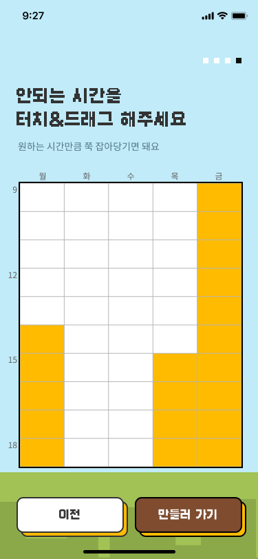

# 🕰️ Time Checker

**시간표 메이커** 프로젝트의 🕰️ **타임 체커** 기능 구현하기

- [🕰️ Time Checker](#️-time-checker)
  - [💡 타임 체커가 뭐예요?](#-타임-체커가-뭐예요)
  - [🎨 UI UX](#-ui-ux)
  - [🗂️ 구현해야 할 기능](#️-구현해야-할-기능)

---

### 💡 타임 체커가 뭐예요?

```
💁 안되는 시간을 미리 체크하여
  사용자의 일정에 꼭 맞는 시간표를 만들어주기 위해 고안해낸 기능
```

- 기존에 자주보이던 방식 (드롭다운, 슬라이더, 타임 피커 ...)보다
- 5일의 시간 설정을 사용자가 더욱 `직관적`이고, `편하게` 할 수 있도록 디자인하였다.
  - _[when2meet](https://www.when2meet.com/) 에서 아이디어를 얻음_

---

### 🎨 UI UX

```
원하는 시간의 칸을 드래그하면 해당 시간이 손쉽게 선택된다.
다시 드래그하면 선택이 취소됨!
```



---

### 🗂️ 구현해야 할 기능

`TimeCell` : 시간 칸 하나

- 마우스가 해당 칸 위에 있을 때 선택

`DayColumn` : 요일 칸 한줄

- '드래그 중'일 때
  - timeCell들이 반응하게 하기
- 선택된 timeCell들을 요일 배열에 넣어줌

`TimeChecker` : 요일 전체 타임 체커

- 각 Column UI 합치기
- 요일 배열 하나로 합치기
  - eg. `"월/1-9,화/2-5"`
